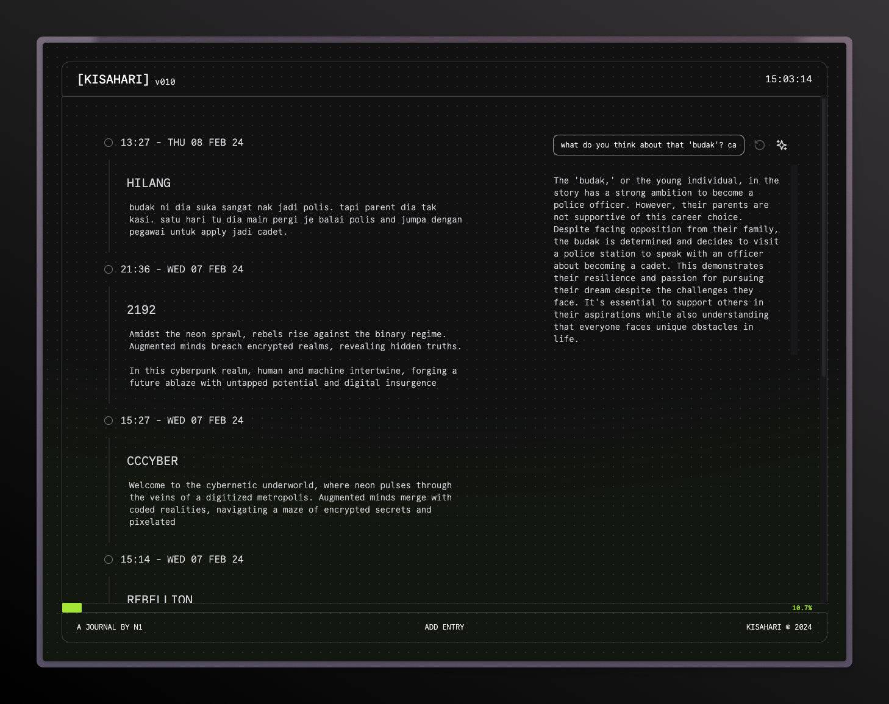

Kisahari, a personal journaling app where you can chat with your entries locally.

## Motivation

A personal journal app where we keep the data locally, while having the power to chat with it using local LLM.

## Features

- Minimal techy look
- NextJS + TailwindCSS
- Keyboard shortcut
- Local LLM support through Ollama
- Langchain for RAG
- Local embedding
- In-memory Vector DB
- Entries stored in IndexedDB
- Model selection for Ollama & OpenAI

## Todo / Ideas

- [x] Option to use OpenAI API
- [x] Model selection for OpenAI
- [ ] Mobile responsive design
- [ ] Allow ollama model pull from within the app
- [ ] Allow theme customization
- [ ] Support markdown
- [ ] Turn into PWA
- [ ] Turn into Tauri app (Desktop)

## Develop

clone the repo

```
git clone https://github.com/0xn1/kisahari.git
```

install dependencies

```
cd kisahari && bun i
```

run development server

```
bun run dev
```

build the app

```
bun run build
```

## Contribute

Feel free to open issue and create PR :)

## Contributors

[](https://github.com/0xn1) [](https://github.com/apikmeister) [](https://github.com/luqmanrom)
